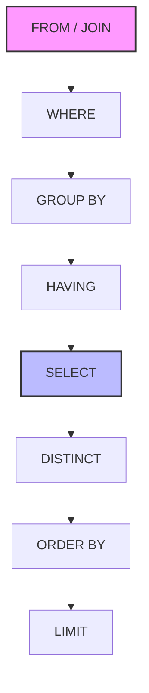

# SQL — Theory & Concepts

> Core concepts of SQL, relational algebra, execution engines, and advanced querying. Crucial for data engineering and backend roles.

---

## Table of Contents

- [🟢 Simple (Fundamentals)](#-simple-fundamentals)
- [🟡 Medium (Intermediate)](#-medium-intermediate)
- [🔴 Hard (Advanced / MAANG-level)](#-hard-advanced--maang-level)

---

## 🟢 Simple (Fundamentals)

### Q1: What is the difference between DDL, DML, DCL, and TCL?

**Answer:**

SQL commands are grouped by their purpose:

| Category | Full Name | Purpose | Commands |
|----------|-----------|---------|----------|
| **DDL** | Data Definition Language | Defines database schema/structure | `CREATE`, `ALTER`, `DROP`, `TRUNCATE` |
| **DML** | Data Manipulation Language | Manages the data itself | `SELECT`, `INSERT`, `UPDATE`, `DELETE` |
| **DCL** | Data Control Language | Manages access rights | `GRANT`, `REVOKE` |
| **TCL** | Transaction Control Language | Manages transactions | `COMMIT`, `ROLLBACK`, `SAVEPOINT` |

**Key distinction:** `TRUNCATE` (DDL) is faster than `DELETE` (DML) because it doesn't log individual row deletions and cannot be rolled back in some databases (like Oracle, though PostgreSQL allows it in transactions).

---

### Q2: Explain the different types of JOINs.

**Answer:**

JOINs combine rows from two or more tables based on a related column.

- **INNER JOIN:** Returns rows where there is a match in *both* tables. (Intersection)
- **LEFT (OUTER) JOIN:** Returns *all* rows from the left table, and matched rows from the right. Unmatched right rows return `NULL`.
- **RIGHT (OUTER) JOIN:** Returns *all* rows from the right table, and matched rows from the left.
- **FULL (OUTER) JOIN:** Returns all rows when there is a match in *either* the left or right table. (Union)
- **CROSS JOIN:** Returns the Cartesian product (all possible combinations). If table A has 5 rows and B has 4 rows, result has 20 rows.
- **SELF JOIN:** A table is joined with itself (useful for hierarchical data like employee-manager relations).

```mermaid
graph LR
    subgraph INNER JOIN
    A((Table A))
    B((Table B))
    end
``` *(Note: Imagine standard Venn diagrams for these).*

---

### Q3: What is the difference between `WHERE` and `HAVING`?

**Answer:**

| Feature | `WHERE` | `HAVING` |
|---------|---------|----------|
| **Filter Target** | Filters individual rows | Filters grouped rows (aggregated data) |
| **Execution Order** | Applied *before* `GROUP BY` | Applied *after* `GROUP BY` |
| **Aggregations** | Cannot use aggregate functions (e.g., `SUM()`, `COUNT()`) | Can use aggregate functions |

```sql
SELECT department_id, COUNT(employee_id) as emp_count
FROM employees
WHERE is_active = true           -- Filters rows BEFORE grouping
GROUP BY department_id
HAVING COUNT(employee_id) > 10;  -- Filters groups AFTER grouping
```

---

### Q4: What are Primary Keys and Foreign Keys?

**Answer:**

- **Primary Key (PK):** A column (or set of columns) that uniquely identifies each row in a table. It must contain `UNIQUE` values and cannot contain `NULL`. A table can have only ONE primary key.
- **Foreign Key (FK):** A column that establishes a link between two tables. It refers to the Primary Key of another table. It enforces **referential integrity** (you can't insert a row with an FK that doesn't exist in the referenced table).

```sql
CREATE TABLE Orders (
    order_id INT PRIMARY KEY,               -- PK
    customer_id INT,
    FOREIGN KEY (customer_id) REFERENCES Customers(customer_id) -- FK
);
```

---

### Q5: What is the difference between `UNION` and `UNION ALL`?

**Answer:**

Both combine the result sets of two or more `SELECT` statements (which must have the same number of columns and compatible data types).

- **`UNION`:** Removes duplicate rows from the final result. (Performs an implicit `DISTINCT` sort, which is slower).
- **`UNION ALL`:** Includes all duplicates. (Much faster as it just appends the data).

*Rule of thumb:* Always use `UNION ALL` unless you specifically need to eliminate duplicates.

---

## 🟡 Medium (Intermediate)

### Q6: Explain Window Functions (Analytics Functions). How do they differ from `GROUP BY`?

**Answer:**

Window functions perform calculations across a set of table rows that are related to the current row, **without collapsing the rows** (unlike `GROUP BY`).

**Key components:** `OVER (PARTITION BY ... ORDER BY ...)`

**Common Window Functions:**
- `ROW_NUMBER()`: Unique sequential integer per row in the partition (1, 2, 3, 4).
- `RANK()`: Same value for ties, skips next numbers (1, 2, 2, 4).
- `DENSE_RANK()`: Same value for ties, does NOT skip numbers (1, 2, 2, 3).
- `LAG()`: Access data from a previous row.
- `LEAD()`: Access data from a subsequent row.

```sql
-- Returns all employees, but adds a column showing their salary rank within their department
SELECT 
    name, 
    department, 
    salary,
    RANK() OVER (PARTITION BY department ORDER BY salary DESC) as dept_rank
FROM employees;
```

---

### Q7: What are Common Table Expressions (CTEs)? When are they better than Subqueries?

**Answer:**

A CTE is a temporary named result set defined using the `WITH` clause.

```sql
WITH HighEarners AS (
    SELECT id, name, salary FROM employees WHERE salary > 100000
)
SELECT * FROM HighEarners WHERE department = 'Engineering';
```

**CTE vs Subqueries:**
1. **Readability:** CTEs are defined at the top and read top-to-bottom, avoiding deeply nested "spaghetti" subqueries.
2. **Reusability:** A CTE can be referenced multiple times in the main query; a subquery must be rewritten.
3. **Recursion:** CTEs can be recursive (`WITH RECURSIVE`), which is impossible with standard subqueries (crucial for tree/graph data).

---

### Q8: What is a View? What is a Materialized View?

**Answer:**

- **View (Virtual Table):** A stored SQL query. When you query a view, the database executes the underlying query on the fly. It takes no storage space (except the query definition) but provides no performance benefit. Useful for simplifying complex queries or restricting access (security).
  
- **Materialized View:** A view where the result set is physically calculated and **stored on disk** as a real table.
  - **Pros:** Extremely fast read performance for complex aggregations.
  - **Cons:** Takes up disk space. The data becomes stale and must be explicitly refreshed (`REFRESH MATERIALIZED VIEW` in Postgres).

---

### Q9: Explain execution order of a SQL query.

**Answer:**

The order in which we *write* SQL is different from how the engine *executes* it.

**Writing Order:**
`SELECT` → `FROM` → `JOIN` → `WHERE` → `GROUP BY` → `HAVING` → `ORDER BY` → `LIMIT`

**Execution Order:**
1. `FROM` / `JOIN` (Identify the working data set)
2. `WHERE` (Filter rows)
3. `GROUP BY` (Aggregate rows)
4. `HAVING` (Filter aggregated groups)
5. `SELECT` (Derive requested columns, execute window functions)
6. `DISTINCT` (Remove duplicates)
7. `ORDER BY` (Sort the final result)
8. `LIMIT` / `OFFSET` (Return subset)



*This is why you cannot use a column alias defined in `SELECT` inside a `WHERE` clause—the `WHERE` clause executes first!*

---

### Q10: What are SQL Injection attacks and how do you prevent them?

**Answer:**

SQL Injection occurs when user input is concatenated directly into a SQL query string, allowing attackers to execute malicious commands.

**Vulnerable code:**
```python
user_id = "1 OR 1=1; DROP TABLE users;"
# DON'T DO THIS:
cursor.execute(f"SELECT * FROM users WHERE id = {user_id}")
```

**Prevention:**
Always use **Parameterized Queries (Prepared Statements)** or ORMs. The database driver ensures the input is treated strictly as data (a string literal) and never as executable code.

```python
# DO THIS:
cursor.execute("SELECT * FROM users WHERE id = %s", (user_id,))
```

---

## 🔴 Hard (Advanced / MAANG-level)

### Q11: How do Recursive CTEs work? Provide a use case.

**Answer:**

Recursive CTEs reference themselves to process hierarchical or graph data (like organizational charts, category trees, or Bill of Materials).

It consists of:
1. **Anchor member:** The base query that starts the recursion.
2. **`UNION ALL`**
3. **Recursive member:** A query that references the CTE itself.
4. Termination condition: Recursion stops when the recursive member returns an empty set.

```sql
-- Get an employee and all their indirect reports
WITH RECURSIVE OrgChart AS (
    -- Anchor: Get the top manager
    SELECT emp_id, name, manager_id, 1 as depth
    FROM employees WHERE emp_id = 1
    
    UNION ALL
    
    -- Recursive: Get employees managed by the people in the CTE
    SELECT e.emp_id, e.name, e.manager_id, o.depth + 1
    FROM employees e
    INNER JOIN OrgChart o ON e.manager_id = o.emp_id
)
SELECT * FROM OrgChart;
```

---

### Q12: Explain the difference between `EXISTS` and `IN`. Which is faster?

**Answer:**

Both are used in subqueries, but they operate differently:

- **`IN`**: Compares a value against a list. It evaluates the subquery, stores the result as a list, and then checks if the outer value is in that list.
- **`EXISTS`**: Returns a boolean. It evaluates true as soon as the subquery returns *at least one row*. It does not return the actual data.

**Performance:**
- If the outer query is large and the subquery is small: `IN` is often faster (subquery evaluated once).
- If the outer query is small and the subquery is large: `EXISTS` is faster (it short-circuits and stops scanning once a match is found).
- **NULL handling:** `NOT IN` fails completely (returns 0 rows) if the subquery contains a single `NULL`. `NOT EXISTS` handles `NULL`s gracefully.

---

### Q13: What is the difference between Clustered and Non-Clustered Indexes?

**Answer:**

- **Clustered Index:** Dictates the **physical sorting order** of the data on the disk. Because data can only be sorted one way, there can be **only one** clustered index per table (usually the Primary Key). The leaf nodes of a clustered index contain the actual row data.
- **Non-Clustered Index:** A separate structure from the data (like an index at the back of a book). It contains a sorted list of the indexed columns and a pointer (rowid or clustered key) back to the actual row data. A table can have multiple non-clustered indexes.

**Lookup speed:** Clustered is faster (data is right there). Non-clustered requires an extra "bookmark lookup" jump to get the full row data.

---

### Q14: Explain transaction isolation levels and the phenomena they prevent.

**Answer:**

Isolation levels determine how concurrent transactions interact and what anomalies can occur.

| Phenomenon | Description |
|------------|-------------|
| **Dirty Read** | Reading uncommitted changes from another transaction. |
| **Non-Repeatable Read** | Reading the same row twice gets different data (another txn updated it). |
| **Phantom Read** | A query returning a set of rows returns different rows the second time (another txn inserted/deleted rows matching the condition). |

| Isolation Level | Dirty Read | Non-Repeatable Read | Phantom Read | Concurrency |
|-----------------|------------|---------------------|--------------|-------------|
| **Read Uncommitted**| Allowed | Allowed | Allowed | Highest |
| **Read Committed**  | Prevented | Allowed | Allowed | High (Postgres default) |
| **Repeatable Read** | Prevented | Prevented | Allowed (MySQL prevents) | Medium (MySQL default) |
| **Serializable**    | Prevented | Prevented | Prevented | Lowest (Locks table) |

---

### Q15: What is a Covering Index?

**Answer:**

A covering index is a non-clustered index that **includes all columns requested in a query's `SELECT`, `JOIN`, and `WHERE` clauses**.

When an index "covers" the query, the database engine can retrieve all required data directly from the index tree, completely avoiding the need to read the actual data pages (the bookmark lookup). This results in massive performance gains for read-heavy queries.

```sql
-- Query:
SELECT first_name, last_name FROM employees WHERE department_id = 5;

-- Covering Index:
CREATE INDEX idx_emp_dept ON employees (department_id) INCLUDE (first_name, last_name);
```
*(Note: `INCLUDE` allows adding columns to the leaf nodes of the index without adding them to the sort tree).*

---

*End of SQL Theory — 15 questions covering fundamentals, window functions, CTEs, indexing, and execution plans.*
