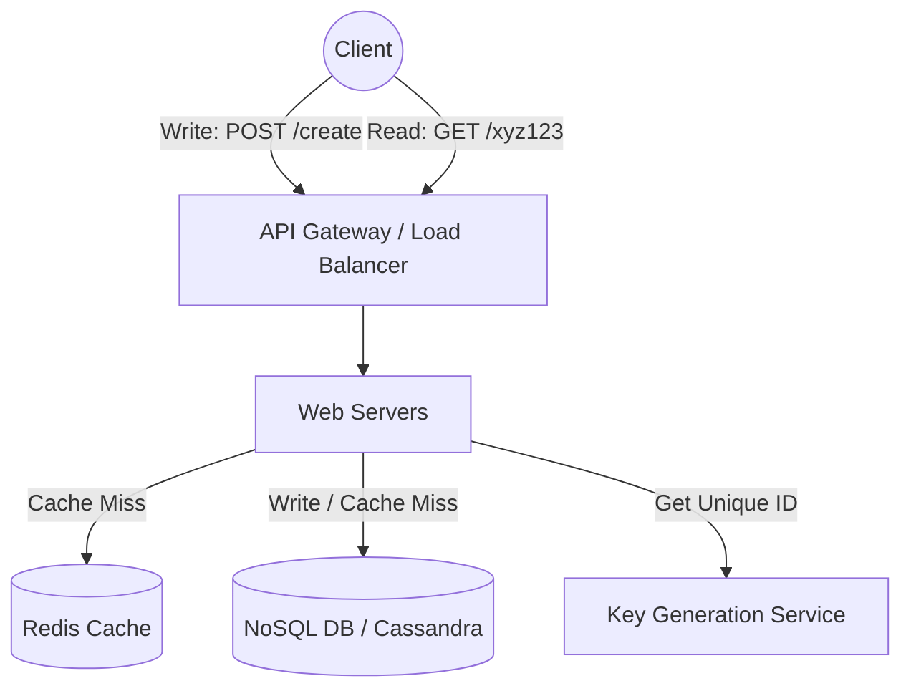
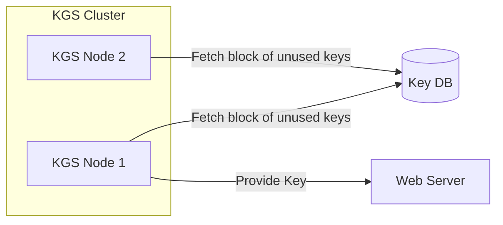
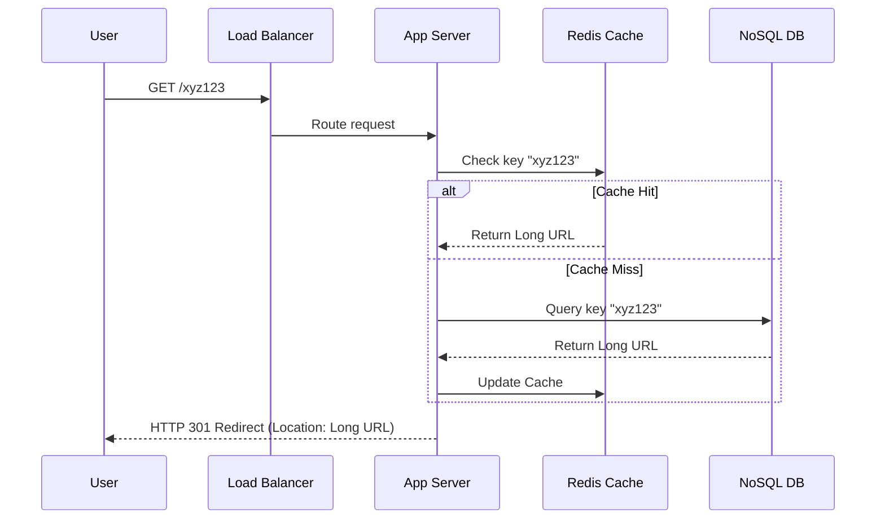
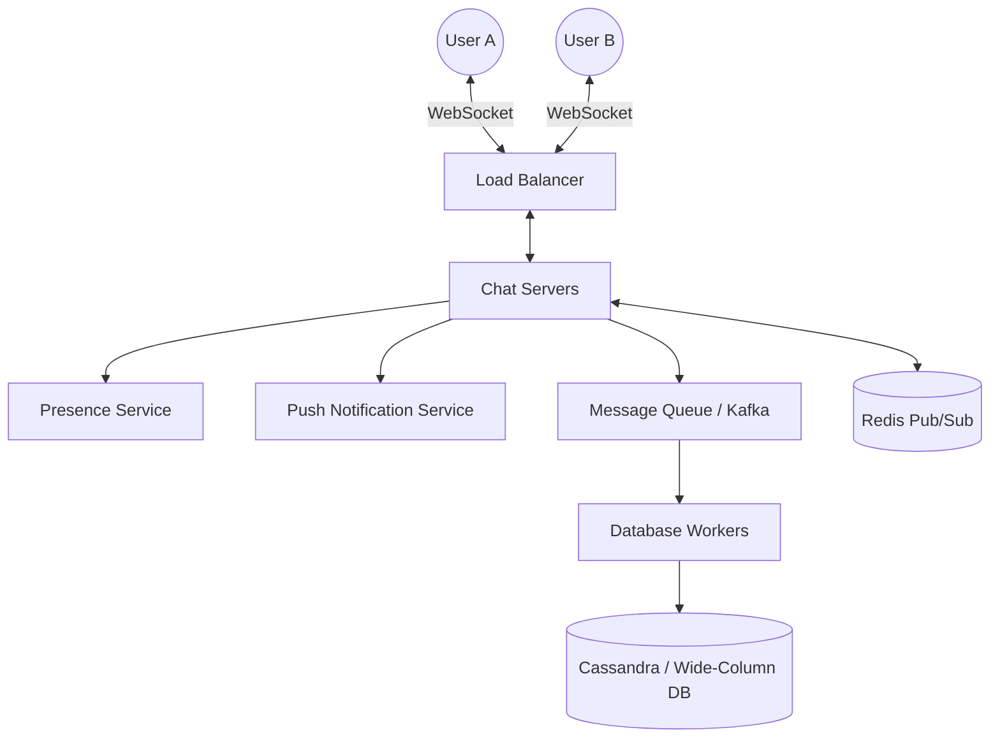
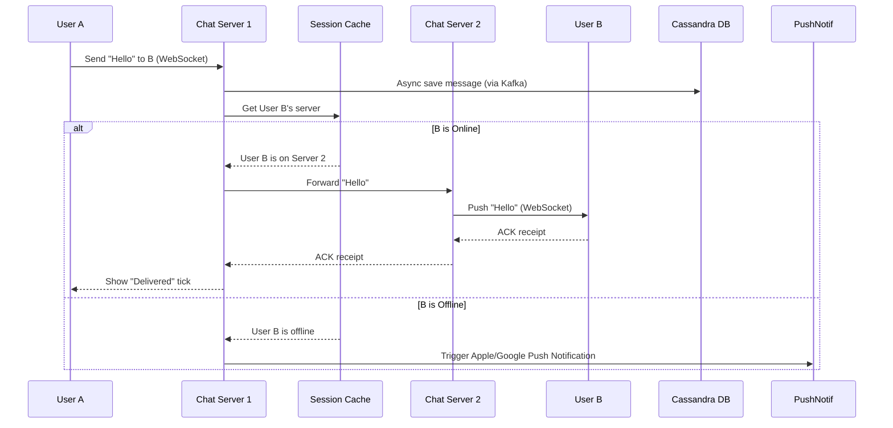
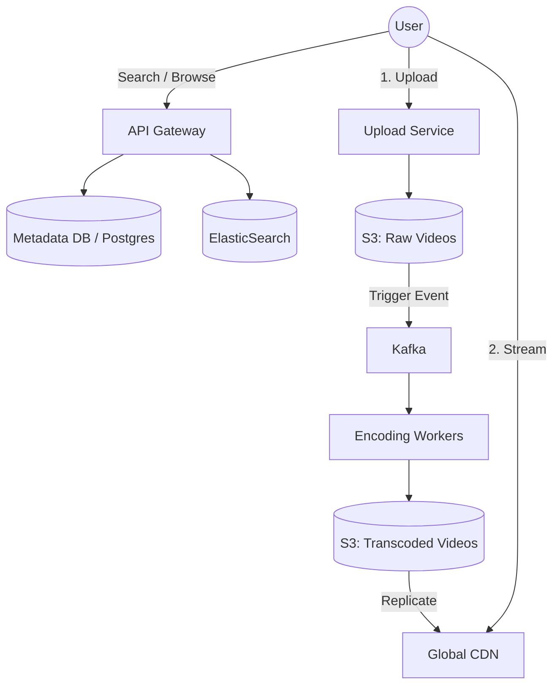
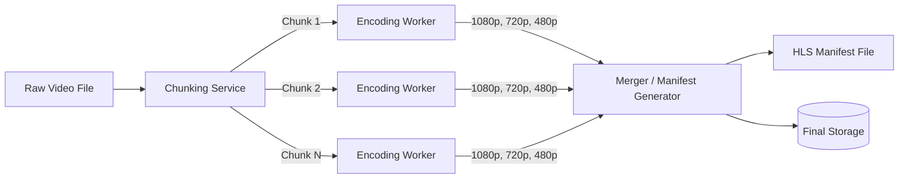
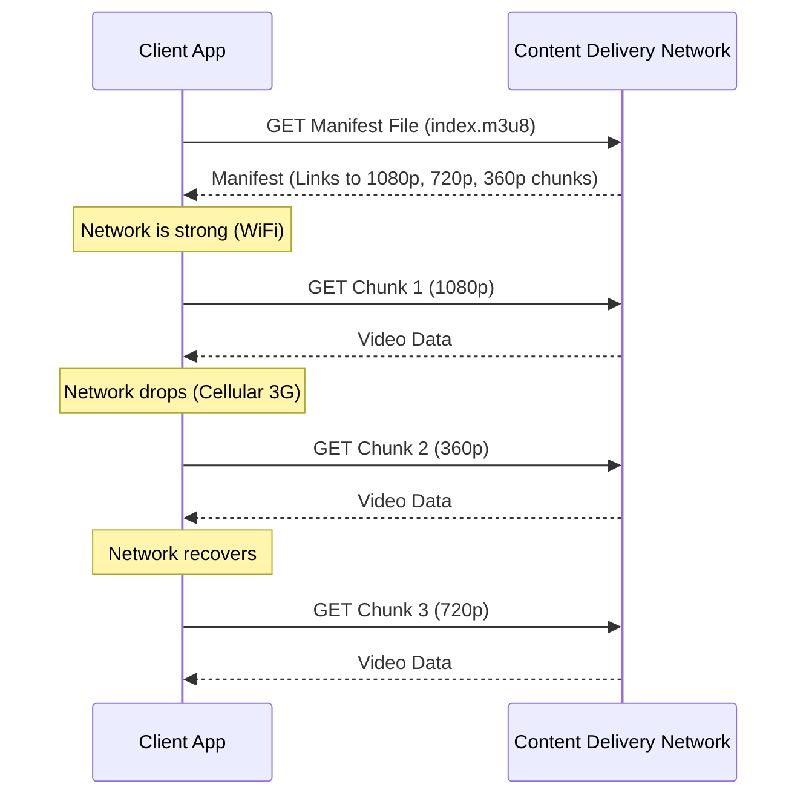

# System Design — Common Problems

> End-to-end architecture designs for classic MAANG system design interviews. Includes High-Level, Component, and Data-Flow diagrams.

---

## Table of Contents

- [1. Design a URL Shortener (TinyURL)](#1-design-a-url-shortener-tinyurl)
- [2. Design a Chat Application (WhatsApp/Discord)](#2-design-a-chat-application-whatsappdiscord)
- [3. Design a Video Streaming Service (Netflix/YouTube)](#3-design-a-video-streaming-service-netflixyoutube)

---

## 1. Design a URL Shortener (TinyURL)

**Requirements:**
- Given a long URL, return a much shorter unique alias.
- When users click the short alias, redirect them to the original URL.
- Links expire after standard timesspan.
- Highly available and scalable (Read-heavy: 100:1 read/write ratio).

### High-Level Architecture



### Component Details: Key Generation Service (KGS)

We need to generate a unique 7-character string (Base62: A-Z, a-z, 0-9). `62^7 = 3.5 trillion` URLs.
Generating keys on the fly using a hash (like MD5) can cause collisions. Instead, we pre-generate them.


*The KGS pre-generates random 7-char strings and stores them in a DB. It loads a batch into memory. When a web server needs a key, it asks the KGS. This avoids DB latency and guarantees uniqueness.*

### Data Flow: Redirection (Read)


*Note: We use **HTTP 301 (Permanent Redirect)** if we want the browser to cache the redirect to reduce server load. We use **HTTP 302 (Temporary Redirect)** if we need to track analytics for every single click.*

---

## 2. Design a Chat Application (WhatsApp/Discord)

**Requirements:**
- 1-on-1 messaging with low latency.
- Online/Offline presence indicator.
- Message persistence (sync across devices).

### High-Level Architecture



### Component Details: Stateful Connection Management

Unlike standard HTTP APIs, chat requires **persistent WebSocket connections**. The system must know exactly which server User B is connected to so it can route User A's message to them.

```mermaid
graph TD
    subgraph Service Discovery / Routing
    UserA -->|Send msg to User B| ChatServer1[Chat Server 1]
    ChatServer1 -->|Where is B?| RedisSession[(Redis Session Cache)]
    RedisSession -->>|B is on Server 3| ChatServer1
    ChatServer1 -->|Forward Msg| ChatServer3[Chat Server 3]
    ChatServer3 -->|Push over WS| UserB
    end
```

### Data Flow: Message Delivery



---

## 3. Design a Video Streaming Service (Netflix/YouTube)

**Requirements:**
- Upload videos, process them, and store them.
- Stream videos globally with minimal buffering.
- Search for videos.

### High-Level Architecture



### Component Details: Video Processing Pipeline

Video files are massive. When a user uploads a 4K video, it cannot be streamed directly. It must be chunked and transcoded into different resolutions (1080p, 720p, 360p) and formats (HLS, DASH) for different devices and network speeds.


*Chunking allows parallel processing. A 1-hour video can be split into 1-minute chunks, encoded by 60 different workers simultaneously, drastically reducing upload-to-publish time.*

### Data Flow: Streaming & Adaptive Bitrate

How does Netflix ensure you don't buffer when you enter a tunnel?


*This is called **Adaptive Bitrate Streaming (ABR)**. The client downloads a tiny text file (manifest) containing links to 5-second video chunks at various resolutions. The client software decides which resolution to request next based on its current bandwidth.*

---

*End of System Design Problems — Practical end-to-end architectures utilizing components like CDNs, WebSockets, Kafka, and Redis.*
