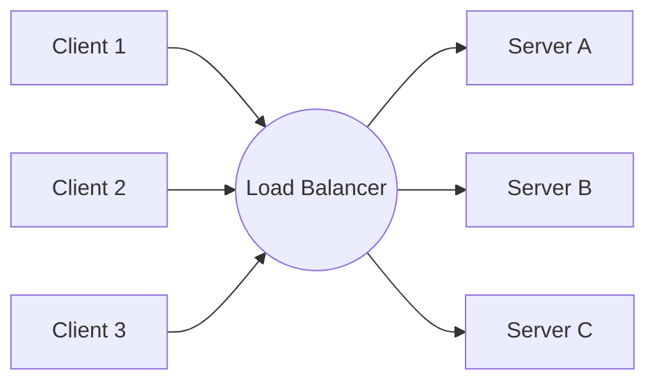

# System Design — Theory & Concepts

> Core concepts of distributed systems: Load balancing, CAP, PACELC, microservices, consistency patterns, and scaling.

---

## Table of Contents

- [🟢 Simple (Fundamentals)](#-simple-fundamentals)
- [🟡 Medium (Intermediate)](#-medium-intermediate)
- [🔴 Hard (Advanced / MAANG-level)](#-hard-advanced--maang-level)

---

## 🟢 Simple (Fundamentals)

### Q1: What is the difference between Vertical Scaling and Horizontal Scaling?

**Answer:**

- **Vertical Scaling (Scale Up):** Adding more power (CPU, RAM, Disk) to an existing server.
  - *Pros:* Very simple. No code changes needed. No distributed system complexity.
  - *Cons:* Hard limit (you can only buy so much RAM). Expensive. Single point of failure. Server downtime required for upgrades.
- **Horizontal Scaling (Scale Out):** Adding more servers to a pool of resources.
  - *Pros:* Infinite scaling potential. High availability (if one server dies, others take over). Cheaper commodity hardware.
  - *Cons:* Complex architecture. Requires a load balancer. Stateful services (like DBs) become very hard to manage.

---

### Q2: What is a Load Balancer? Name common algorithms.

**Answer:**

A Load Balancer distributes incoming network traffic across a group of backend servers (a server farm or server pool).

**Benefits:**
- Prevents any single server from overloading.
- Increases availability (it performs health checks and stops sending traffic to dead servers).

**Common Algorithms:**
1. **Round Robin:** Sequential (Server A, then B, then C, repeat).
2. **Least Connections:** Sends traffic to the server with the fewest active connections.
3. **IP Hash:** Hashes the client's IP address to determine the server. Ensures a specific user always hits the same server (sticky sessions).

---

### Q3: What is a CDN (Content Delivery Network)?

**Answer:**

A CDN is a geographically distributed group of servers that work together to provide fast delivery of static Internet content (HTML pages, javascript files, stylesheets, images, and videos).

When a user requests an image, the CDN routes the request to the Edge Server closest to the user's physical location.

**Benefits:**
- **Drastically reduces latency** (User in Tokyo gets image from Tokyo, not from the Origin server in New York).
- **Reduces bandwidth costs** on the Origin server.
- **Provides DDoS protection** (CDNs can absorb massive traffic spikes).

---

## 🟡 Medium (Intermediate)

### Q4: Explain the differences between Monolith and Microservices architectures.

**Answer:**

| Feature | Monolith | Microservices |
|---------|----------|---------------|
| **Structure** | Single unified codebase and executable. | Collection of small, independent services. |
| **Database** | Single shared database. | Database per service (loose coupling). |
| **Scaling** | Must scale the entire application. | Can scale individual bottlenecks (e.g., scale only the Payment service). |
| **Deployment**| Slow, risky deployments (entire app restarts). | Fast, independent deployments. |
| **Complexity**| Simple initially, spaghetti code later. | Operational complexity (requires CI/CD, K8s, distributed tracing). |
| **Failure** | A memory leak in one module crashes the whole app. | A crash in the Review service doesn't affect the Checkout service. |

---

### Q5: What is the PACELC Theorem? (Extension of CAP)

**Answer:**

The CAP theorem states that in the event of a network Partition (P), you must choose between Availability (A) and Consistency (C). 
However, network partitions are rare. **What happens during normal operations?**

PACELC states:
- If there is a **P**artition, choose between **A**vailability and **C**onsistency.
- **E**lse (during normal operation), choose between **L**atency and **C**onsistency.

**Examples:**
- **DynamoDB/Cassandra (PA/EL):** When partitioned, they prioritize Availability. Normally, they prioritize low Latency over strict consistency (Eventual Consistency).
- **MongoDB/HBase (PC/EC):** When partitioned, they prioritize Consistency (stop accepting writes). Normally, they prioritize Consistency over Latency (reading from the leader takes longer than reading from the closest replica).

---

### Q6: What is a Reverse Proxy? How does it differ from a Forward Proxy?

**Answer:**

- **Forward Proxy:** Sits in front of **Clients** (e.g., a corporate firewall). The server doesn't know who the actual client is. (Protects clients).
- **Reverse Proxy:** Sits in front of **Servers** (e.g., Nginx, HAProxy). The client doesn't know which actual backend server processed the request. (Protects servers).

**Duties of a Reverse Proxy:**
1. **Load Balancing**
2. **SSL Termination:** Decrypts HTTPS traffic, relieving backend servers of CPU-heavy decryption.
3. **Caching:** Caches static content or frequent dynamic requests.
4. **Compression:** Gzips responses to save bandwidth.

---

## 🔴 Hard (Advanced / MAANG-level)

### Q7: Explain Consistency Patterns (Strong, Eventual, Causal).

**Answer:**

When data is replicated across multiple nodes, how do we ensure users see the right data?

1. **Strong (Strict) Consistency:** After a write completes, *any* subsequent read (from *any* node) will return the updated value. 
   - *Cost:* High latency. The write must be synchronously copied to all replicas before returning success.
2. **Eventual Consistency:** If no new updates are made, eventually all accesses will return the last updated value.
   - *Cost:* Stale reads. A user updates their profile, refreshes the page, and sees their old profile for a few seconds. High availability, low latency.
3. **Causal (Read-Your-Own-Writes) Consistency:** A middle ground. The system guarantees that if a user updates their profile, *that specific user* will instantly see the update (perhaps pinned to a specific replica), while other users may see the old version eventually.

---

### Q8: How do you handle distributed transactions? (Saga Pattern)

**Answer:**

In microservices, you cannot use a single SQL transaction to span the `Order Service`, `Inventory Service`, and `Payment Service`. (Two-Phase Commit is too slow and blocking).

**The Saga Pattern:**
A Saga is a sequence of local transactions. Each local transaction updates the database and publishes an event to trigger the next local transaction in the Saga.

**If a step fails (e.g., Payment fails after Inventory was reserved):**
The Saga executes **Compensating Transactions** to undo the preceding steps.
1. `OrderCreatedEvent` -> Inventory Service reserves stock.
2. `StockReservedEvent` -> Payment Service attempts charge.
3. *Payment Fails* -> Payment Service publishes `PaymentFailedEvent`.
4. Inventory Service consumes `PaymentFailedEvent` -> executes a compensating transaction to release the stock.
5. Order Service consumes `PaymentFailedEvent` -> sets Order Status to "Cancelled".

---

### Q9: What is Rate Limiting? Explain Token Bucket vs Leaky Bucket algorithms.

**Answer:**

Rate limiting protects APIs from abuse, DDoS attacks, and resource starvation.

1. **Token Bucket (Most Common - e.g., AWS API Gateway):**
   - A bucket holds a maximum of `N` tokens.
   - Tokens are added to the bucket at a fixed rate `R` per second.
   - When a request arrives, it must take 1 token. If the bucket is empty, the request is dropped (HTTP 429).
   - *Pros:* Allows short bursts of traffic (up to `N` requests instantly).

2. **Leaky Bucket (e.g., Nginx):**
   - Requests enter the top of the bucket at any rate.
   - Requests "leak" out of the bottom (are processed) at a strictly constant rate.
   - If the bucket fills up, new requests spill over and are dropped.
   - *Pros:* Smooths out bursts. Processes requests at a strict, predictable rate.

---

### Q10: Explain the "Thundering Herd" problem and jitter.

**Answer:**

**The Problem:** Hundreds of servers or background jobs are configured to run a task at exactly midnight. Or, a critical microservice comes back online after a crash, and 10,000 pending requests hit it simultaneously, immediately crashing it again.

**The Solution:**
Add **Jitter** (Randomness) to retries and scheduled tasks.
Instead of: `retry_in = base_delay * (2 ^ attempt)` (Exponential Backoff)
Use: `retry_in = random_between(0, base_delay * (2 ^ attempt))` (Exponential Backoff with Jitter).

This spreads out the spikes, allowing the recovering service breathing room to process requests.

---

*End of System Design Theory — 10 questions covering fundamentals, patterns, and distributed system anomalies.*
