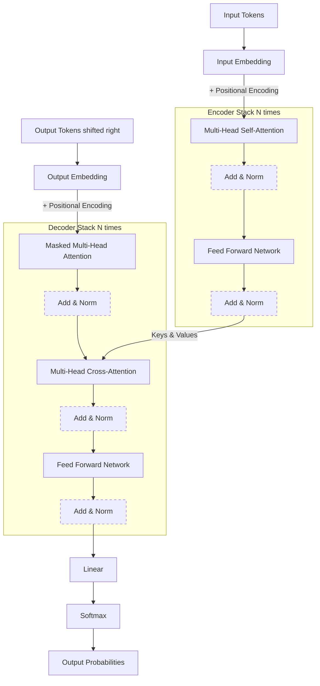

# Deep Dive: The Transformer Architecture

> A complete component-by-component breakdown of the original 2017 "Attention Is All You Need" Transformer architecture. Understanding this blueprint is mandatory for any Senior AI/ML role.

---

## The Architecture Diagram

---

## 1. Input Processing

Before text enters the neural network, it must be converted into math.

### Input Embeddings
- **What it does:** Converts discrete tokens (like "apple") into dense continuous vectors (e.g., of size $d_{model} = 512$).
- **Why it matters:** It captures semantic meaning. Similar words will be placed closer together in this 512-dimensional space.

### Positional Encodings
- **The Problem:** Unlike RNNs which process words sequentially (1st, 2nd, 3rd), Transformers process *all words at once* in parallel. Without position information, the sentence "The dog bit the man" is identical to "The man bit the dog".
- **The Solution:** We generate a mathematical vector for each position (using Sine waves for even dimensions and Cosine waves for odd dimensions) and **add** it directly to the Input Embedding.
- **Why Sinusoidal?** It allows the model to easily learn relative positions (e.g., word $A$ is 3 words away from word $B$) regardless of the total sequence length.

---

## 2. The Encoder Stack

The Encoder's job is to look at the input sentence and build a massive, context-rich representation of what it means. The original Transformer repeats this block 6 times ($N=6$).

### Multi-Head Self-Attention
- **Concept:** Every word looks at every *other* word in the input sequence to understand its own context. (Does "bank" mean river bank or financial bank? Looking at surrounding words answers this).
- **The Math (Query, Key, Value):** 
  - Each word creates a Query (what I'm looking for), a Key (what I contain), and a Value (my actual meaning).
  - Attention Score = $Softmax(\frac{Q \cdot K^T}{\sqrt{d_k}})$.
  - We multiply this score by $V$ to get the final output.
- **Multi-Head:** Instead of doing this once, we do it 8 times in parallel (8 heads). Head 1 might focus on grammar, Head 2 on who is doing the action, Head 3 on locations, etc.

### Add & Norm (Residual Connections + LayerNorm)
- **Add (Residual/Skip Connection):** We take the original input to the attention layer and *add* it to the output ($Output = X + Attention(X)$). This creates a highway for gradients to flow backward during training, preventing the vanishing gradient problem in deep networks.
- **Norm (Layer Normalization):** Normalizes the output across the feature dimension (mean 0, variance 1) to stabilize and speed up training.

### Feed Forward Network (FFN)
- **Concept:** A standard fully-connected Neural Network applied identically to every single token independently.
- **Architecture:** Usually expands the dimension significantly (e.g., $512 \rightarrow 2048 \rightarrow 512$) using a ReLU activation in the middle.
- **Why it matters:** While Attention moves information *between* words, the FFN processes and transforms the information *within* each word's individual vector.

---

## 3. The Decoder Stack

The Decoder's job is to take the Encoder's context and generate the output sequence one token at a time (Autoregressive generation). It also repeats 6 times.

### Masked Multi-Head Attention
- **The Problem:** During training, we feed the entire target sentence into the Decoder at once to parallelize training. However, the model shouldn't be allowed to "look into the future" to guess the next word—that would be cheating.
- **The Mask:** We apply a triangular mask (setting future positions to $-\infty$) before the Softmax. This forces word 3 to only attend to words 1, 2, and 3.

### Multi-Head Cross-Attention
- **Concept:** This is where the translation/generation actually happens.
- **How it connects:** 
  - The **Queries** come from the *Decoder* (the word we are currently generating).
  - The **Keys and Values** come from the *Encoder* (the full context of the input sentence).
- **Analogy:** "I am currently generating the French word for 'apple' (Query). Let me look at all the English input words (Keys) and extract the meaning of the English word 'apple' (Value)."

### Add & Norm + Feed Forward
- Operates exactly the same as in the Encoder block.

---

## 4. Final Output Generation

### Linear Layer & Softmax
- **Linear Layer:** Projects the final 512-dimensional vector of the current token up to the size of the entire vocabulary (e.g., 50,000 dimensions).
- **Softmax:** Converts these raw scores (logits) into a probability distribution. The word with the highest probability is chosen as the next generated word.

---

## Summary of Data Flow

1. **Input:** "Hello World" $\rightarrow$ Embeddings $\rightarrow$ + Positional Encoding
2. **Encoder:** Processes "Hello World" heavily, outputting a rich tensor of shape `[batch, seq_len, 512]`.
3. **Decoder (Step 1):** Takes `<START>` token. Attends to `<START>`. Cross-attends to the Encoder output. Generates "Bonjour".
4. **Decoder (Step 2):** Takes `<START> Bonjour`. Attends to both. Cross-attends to the Encoder output. Generates "le".
5. **Loop** until `<END>` token is generated.
