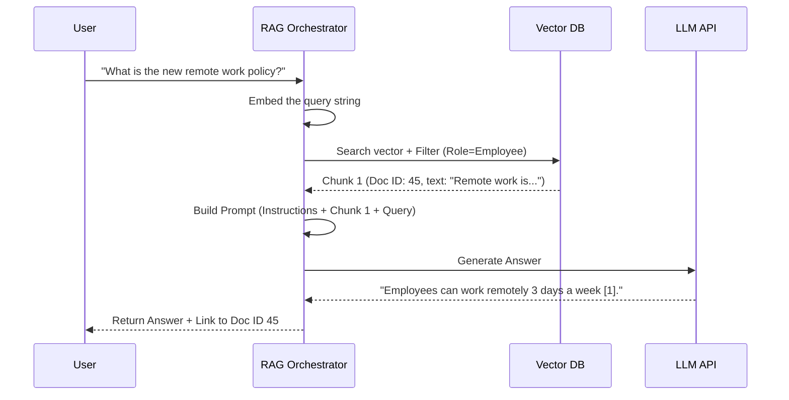
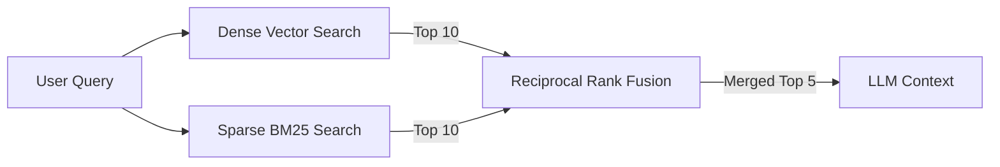
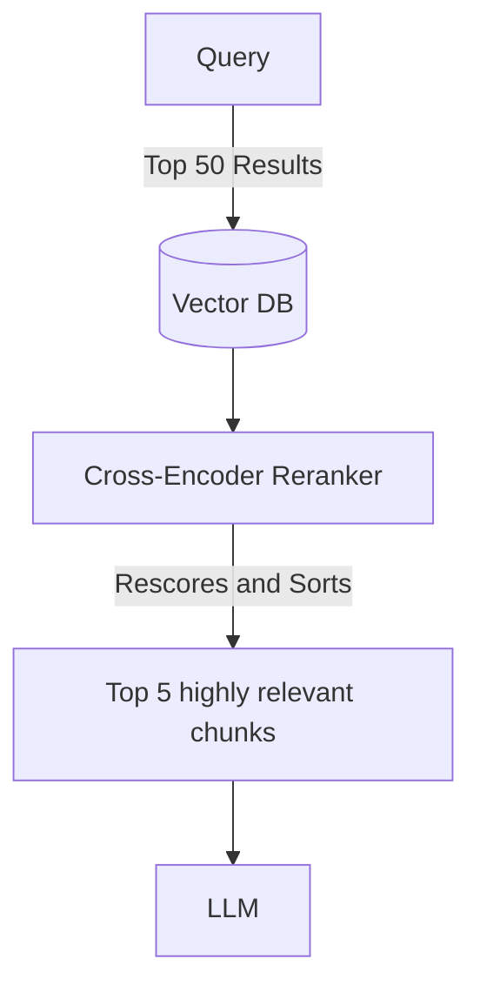

# Retrieval-Augmented Generation (RAG) System Design

> Architecting RAG systems for production: Chunking strategies, Vector Databases, advanced retrieval (Hybrid, Re-ranking), and evaluating LLM outputs.

---

## Table of Contents

- [1. Standard RAG Architecture](#1-standard-rag-architecture)
- [2. Problem: Design an Enterprise Document QA System](#2-problem-design-an-enterprise-document-qa-system)
- [3. Advanced Retrieval Strategies](#3-advanced-retrieval-strategies)

---

## 1. Standard RAG Architecture

RAG solves the core limitations of Large Language Models (LLMs): hallucinations and lack of access to private/recent data. It does this by retrieving relevant facts from a database *before* generating the answer.

### High-Level RAG Pipeline

```mermaid
graph TD
    subgraph Data Ingestion (Offline)
        Docs[Documents / PDFs] --> Parser[Text Extraction / OCR]
        Parser --> Chunker[Chunking / Splitting]
        Chunker --> Embedder[Embedding Model e.g. text-embedding-3]
        Embedder --> VectorDB[(Vector DB)]
    end
    
    subgraph Query Execution (Online)
        User((User)) -->|Query| API[Query API]
        API --> QueryEmbedder[Embedding Model]
        QueryEmbedder -->|Vector Query| VectorDB
        VectorDB -->> API: Top-K Relevant Chunks
        
        API --> PromptBuilder[Prompt Engineering]
        PromptBuilder -->|Context + Query| LLM[LLM e.g. GPT-4]
        LLM -->> User: Generated Answer
    end
```

---

## 2. Problem: Design an Enterprise Document QA System

**Requirements:**
- Ingest thousands of PDFs, Word docs, and Confluence pages.
- Provide accurate, citable answers based *only* on enterprise data.
- Enforce Access Control (User A shouldn't see answers from HR documents if they aren't in HR).

### High-Level Architecture

```mermaid
graph TD
    User((User)) -->|Query + User Token| Gateway[API Gateway]
    
    Gateway --> Orchestrator[LangChain / LlamaIndex]
    
    Orchestrator --> AuthZ[Access Control Service]
    AuthZ -->> Orchestrator: User Roles (e.g., [Engineering, Public])
    
    Orchestrator --> Retriever[Retrieval Service]
    Retriever -->|Metadata Filter + Vector| Pinecone[(Pinecone / Weaviate)]
    
    Orchestrator --> Generator[LLM Generation Service]
    Generator --> Prompt[Strict System Prompt]
    Prompt --> OpenAIApi[(OpenAI API)]
```

### Component Details

**1. Data Ingestion & Chunking:**
- **Parsing:** Extracting text from PDFs is hard (tables, images, columns). Use tools like Unstructured.io or Azure Document Intelligence.
- **Chunking Strategy:** 
  - *Fixed Size:* Chunk by 500 tokens with 50-token overlap. (Simple, but breaks mid-sentence).
  - *Semantic Chunking:* Split by paragraph or section headers. (Better context).
- **Metadata:** Every chunk stored in the Vector DB *must* include metadata: `document_id`, `department_access`, `date_uploaded`.

**2. Access Control (Metadata Filtering):**
- When retrieving from the Vector DB, we cannot just do a pure similarity search, because it might return highly relevant HR salary documents to an engineer.
- **Solution:** Use Pre-filtering. The query to the Vector DB becomes: 
  `Find Top 3 vectors similar to [X] WHERE department IN user_roles`

### Data Flow: Query Execution with Citations



---

## 3. Advanced Retrieval Strategies

As RAG scales, "naive" RAG (simple cosine similarity search) fails. It retrieves irrelevant chunks, leading to bad answers. We must improve retrieval.

### A. Hybrid Search

Vector search is great for semantic meaning ("vacation policy" matches "time off"). It is terrible for exact keyword matching (searching for a specific error code like "ERR_504_TIMEOUT").

**Solution:** Combine Vector Search with traditional Keyword Search (BM25/ElasticSearch).


*RRF merges the two ranked lists, giving the best of both worlds.*

### B. Query Expansion / Rewriting

Users often write bad queries (e.g., just typing "remote work"). The LLM can be used to rewrite or expand the query before searching the database.

1. **Multi-Query:** LLM rewrites the user query into 3 different variations. Search the DB for all 3, pool the results, and remove duplicates.
2. **HyDE (Hypothetical Document Embeddings):** The LLM generates a "fake" hypothetical answer to the user's question without any context. We embed this *fake answer* and search the DB with it, rather than embedding the short user query. (Often retrieves much better documents).

### C. Re-Ranking (Cross-Encoders)

Standard embedding models (Bi-encoders) calculate similarity extremely fast (dot product) but lack deep contextual understanding of how the query and the chunk relate to each other.

**Solution:** A Two-Stage Retrieval Pipeline.
1. **Stage 1 (Fast Retrieval):** Vector DB retrieves the Top 50 chunks using fast cosine similarity.
2. **Stage 2 (Re-ranking):** Pass the Query and the 50 chunks through a highly accurate, but slow, **Cross-Encoder Model** (like Cohere Rerank or BGE-Reranker). This model scores the exact relevance of each chunk to the query.
3. Keep only the absolute best Top 5 chunks to send to the LLM.



---

*End of RAG System Design — Architectures covering Data Ingestion, Access Control, Hybrid Search, and Re-ranking pipelines.*
