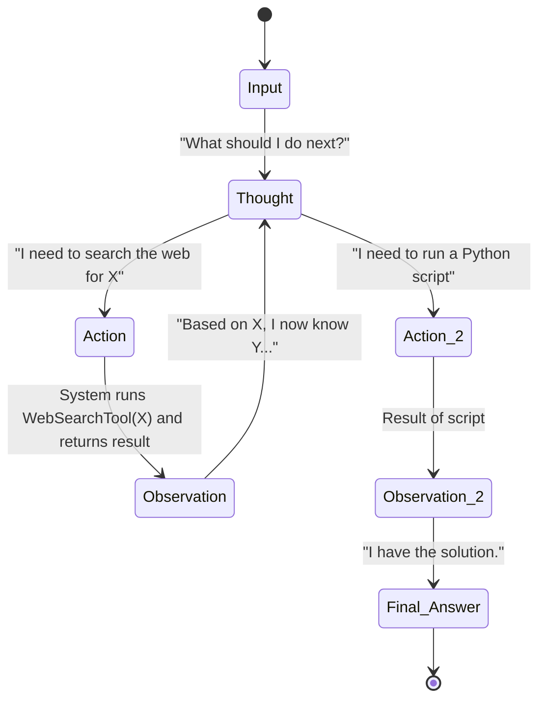
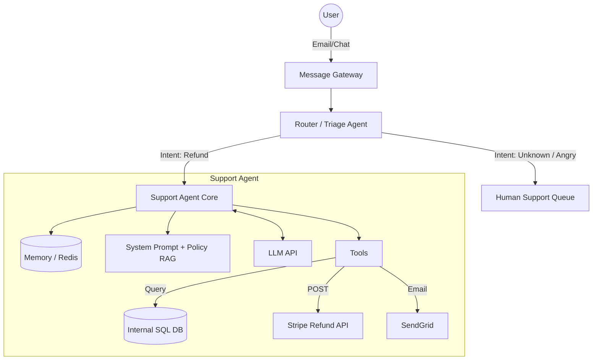
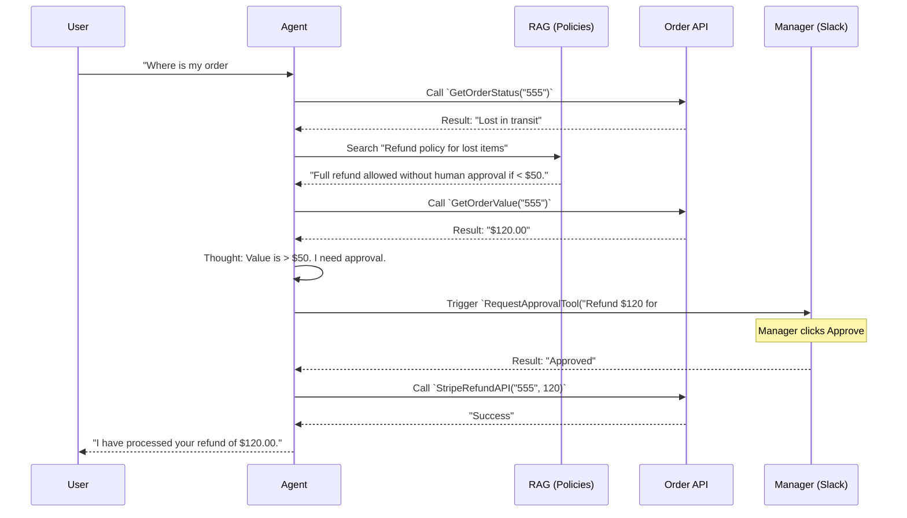
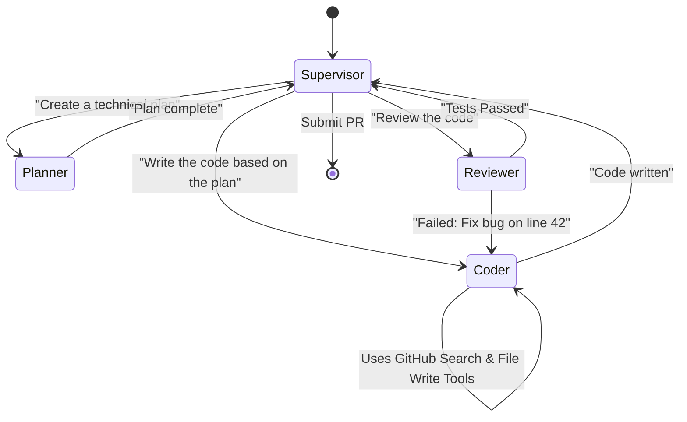

# Agentic AI System Design

> Designing autonomous LLM agents using ReAct, LangGraph, Multi-Agent architectures, Tool calling, and Memory management.

---

## Table of Contents

- [1. Agent Architecture Fundamentals](#1-agent-architecture-fundamentals)
- [2. Problem: Design a Customer Support Autonomous Agent](#2-problem-design-a-customer-support-autonomous-agent)
- [3. Multi-Agent Systems (LangGraph / AutoGen)](#3-multi-agent-systems-langgraph--autogen)

---

## 1. Agent Architecture Fundamentals

An LLM on its own is just a text generator. An **Agent** is an LLM given the ability to "think" (reasoning), "act" (tool use), and "remember" (memory) to achieve a goal autonomously.

### Core Components of an Agent

1. **Brain (LLM):** The reasoning engine (e.g., GPT-4, Claude 3.5 Sonnet).
2. **Memory:**
   - *Short-term:* The context window of the current conversation.
   - *Long-term:* Vector DB storing past interactions and summaries.
3. **Tools (Action Space):** Web search, Python REPL, SQL executors, API clients. The LLM decides which tool to use, outputs the arguments, and the system executes the tool and returns the result to the LLM.
4. **Planning Engine:** Frameworks like ReAct (Reason + Act) or Plan-and-Solve.

### The ReAct (Reasoning and Acting) Loop

The foundation of most single-agent systems. The LLM iterates through a cycle until the task is complete.



---

## 2. Problem: Design a Customer Support Autonomous Agent

**Requirements:**
- Handle incoming user emails/chats regarding orders and refunds.
- Autonomously query the SQL database for order status.
- Issue refunds via the Stripe API if the policy allows.
- Escalate to a human if the user is angry or the request is complex.

### High-Level Architecture



### Component Details

**1. The Triage Router (Semantic Routing):**
Before giving a powerful agent control, a smaller, faster model (or a fast embedding classifier) categorizes the intent. If the sentiment is highly negative, it bypasses the agent entirely.

**2. Guardrails & Tool Calling:**
We cannot just give an LLM raw SQL access. 
- **Tool Design:** Instead of `ExecuteSQLTool`, we give the LLM specific, constrained tools: `GetOrderStatus(order_id: str)` and `IssueRefund(order_id: str, amount: float, reason: str)`.
- **Human-in-the-Loop (HITL):** For high-risk actions (like issuing a refund over $100), the system intercepts the tool call, sends a Slack message to a manager with an "Approve/Reject" button, and pauses the agent until the webhook fires.

### Data Flow: Executing a Refund



---

## 3. Multi-Agent Systems (LangGraph / AutoGen)

Single agents (like standard ReAct) get confused if the task is too complex, falling into infinite loops or hallucinating tools. 

**Multi-Agent Architecture** solves this by breaking the problem into specialized agents with distinct roles, system prompts, and toolsets, governed by a State Machine.

### Why LangGraph?
LangGraph models agent workflows as Graphs (nodes and edges) with a shared State. It allows for cyclic graphs (loops), which are essential for agentic behavior, unlike standard linear DAGs.

### Problem: Design a Software Engineering Multi-Agent Team

We want a system that can take a Jira ticket, write the code, test it, and submit a PR.



### Component Details: Shared State

In LangGraph, all agents read from and write to a shared State object (like a Redux store).

```python
# Simplified LangGraph State representation
class TeamState(TypedDict):
    messages: Annotated[list[BaseMessage], operator.add]
    current_task: str
    code_snippets: dict
    tests_passed: bool
    reviewer_feedback: str
```

- When the `Coder` agent runs, it reads the `current_task` from the state. It writes its output to `code_snippets`.
- The `Reviewer` agent wakes up, reads `code_snippets`, runs a Python execution tool, and updates `tests_passed` and `reviewer_feedback`.
- The graph's conditional edges check `if state.tests_passed == False`, route back to `Coder`.

**Benefits of this design:**
1. **Separation of Concerns:** The Coder doesn't need to know how to review. It has a focused prompt.
2. **Resilience:** If the Coder writes bad code, the Reviewer catches it and loops it back. This internal reflection loop is the key to advanced agentic AI.

---

*End of Agent System Design — Architectures covering ReAct loops, Tool Calling with HITL, and LangGraph Multi-Agent state machines.*
