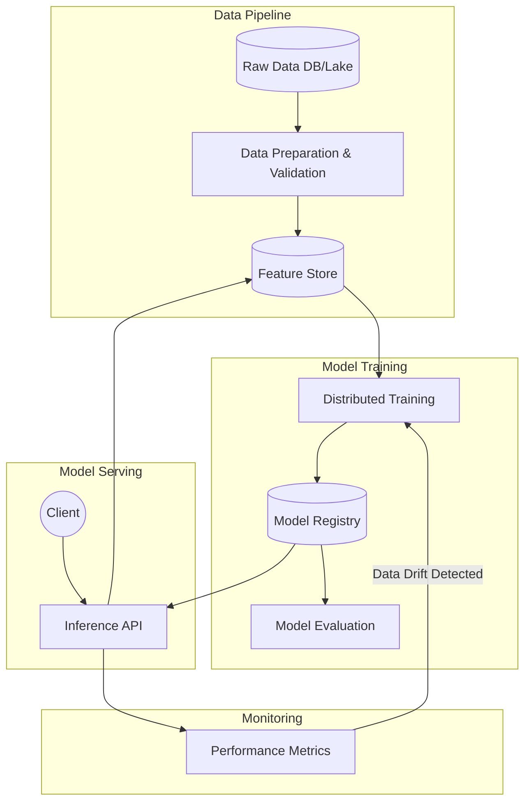
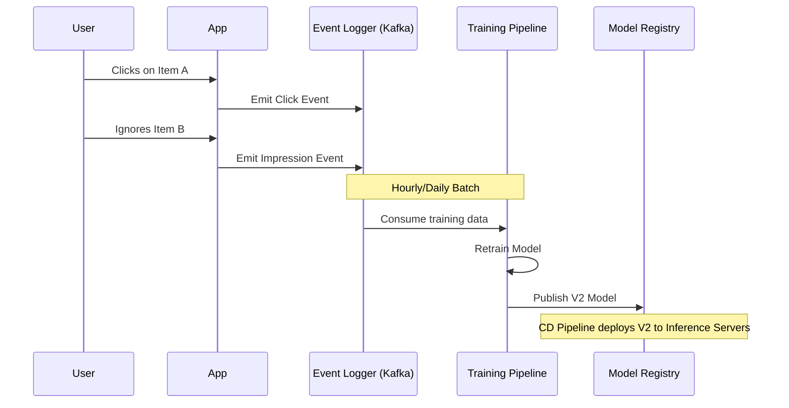
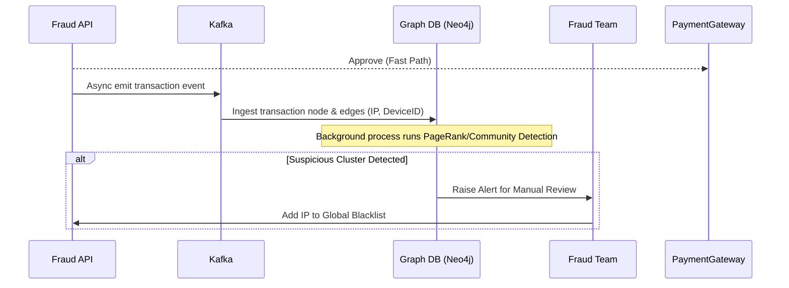

# Machine Learning System Design

> End-to-end architecture for ML systems in production: Feature stores, model serving, continuous training, and classic ML system design problems.

---

## Table of Contents

- [1. ML System Architecture Overview](#1-ml-system-architecture-overview)
- [2. Problem: Design a Recommendation System (e.g., Netflix/YouTube)](#2-problem-design-a-recommendation-system)
- [3. Problem: Design a Fraud Detection System](#3-problem-design-a-fraud-detection-system)

---

## 1. ML System Architecture Overview

An ML system in production is much more than just a Jupyter notebook. It requires robust infrastructure for data, training, serving, and monitoring.

### High-Level ML Platform



### Key Components

1. **Feature Store:** A centralized repository for storing, sharing, and managing ML features. It ensures consistency between offline training data and online inference data.
2. **Model Registry:** A version control system for ML models (e.g., MLflow). Stores model weights, hyperparameters, and metrics.
3. **Inference Server:** Exposes the model via an API (e.g., TF Serving, TorchServe, Triton).

---

## 2. Problem: Design a Recommendation System

**Requirements:**
- Recommend items (movies, products, ads) to a user on the homepage.
- Low latency (< 100ms) for serving.
- Handle millions of items and millions of users.

### High-Level Architecture (Two-Stage Recommendation)

Recommending from a catalog of 10 million items in 100ms is impossible for heavy ML models. We solve this using a **funnel approach (Candidate Generation → Ranking)**.

```mermaid
graph TD
    Client((User)) -->|GET /recommendations| API[API Gateway]
    
    API --> RecService[Recommendation Service]
    
    subgraph Stage 1: Candidate Generation
    RecService --> CG[Candidate Generator]
    CG -->|Query| FAISS[(Vector DB / FAISS)]
    CG -->|Query| UserHistory[(User History)]
    FAISS -->> CG: Return 1,000 items
    end
    
    subgraph Stage 2: Ranking
    CG -->|Pass 1,000 items| Ranker[Ranking Model]
    Ranker -->|Fetch user/item features| FeatureStore[(Feature Store)]
    Ranker -->> RecService: Return Top 50 items
    end
    
    RecService -->> Client: Display Recommendations
```

### Component Details

**1. Candidate Generation (Retrieval):**
- **Goal:** Filter 10 million items down to ~1,000 relevant candidates very quickly.
- **Algorithm:** Matrix Factorization, Two-Tower Neural Networks, Item-Item Collaborative Filtering.
- **Infrastructure:** The item embeddings and user embeddings are generated offline. At inference time, we use an Approximate Nearest Neighbor (ANN) search engine like FAISS, Pinecone, or Milvus to quickly find items whose embeddings are closest to the user's embedding.

**2. Ranking (Scoring):**
- **Goal:** Precisely score and sort the 1,000 candidates to find the absolute best 50 items for the user.
- **Algorithm:** Complex Deep Neural Networks (e.g., DLRM, Wide & Deep), Gradient Boosted Trees (XGBoost).
- **Process:** The Ranker takes the 1,000 candidate IDs. It fetches dense features (user age, item category, historical click rates) from the **Feature Store** (usually backed by Redis for sub-millisecond access). It runs the heavy ML model on these 1,000 items and sorts them by predicted Click-Through Rate (pCTR).

### Data Flow: Continuous Training

Recommendation models go stale quickly as user behavior changes.



---

## 3. Problem: Design a Fraud Detection System

**Requirements:**
- Evaluate transactions in real-time to block fraudulent payments.
- Extremely low latency (e.g., < 50ms) so payment isn't delayed.
- High recall (don't miss fraud), but reasonable precision (don't block too many legitimate users).

### High-Level Architecture

```mermaid
graph TD
    PaymentGateway((Payment Gateway)) -->|POST /score| FraudAPI[Fraud API]
    
    FraudAPI --> RulesEngine[Heuristics / Rules Engine]
    FraudAPI --> MLModel[ML Inference Server]
    
    MLModel -->|Fetch real-time features| FeatureStore[(Feature Store: Redis)]
    
    subgraph Feature Calculation
    TransactionsStream[Kafka: Transactions] --> Flink[Apache Flink]
    Flink -->|Update velocity features| FeatureStore
    end
    
    RulesEngine -->> FraudAPI: Score
    MLModel -->> FraudAPI: Score
    
    FraudAPI -->> PaymentGateway: Approve / Decline
```

### Component Details

**1. Rules Engine vs ML Model:**
- **Rules Engine:** Hardcoded heuristics (e.g., `IF transaction_amount > $10,000 AND IP_Country != Card_Country THEN BLOCK`). Evaluated instantly. Captures obvious fraud.
- **ML Model:** Tree-based models (XGBoost, Random Forest) or Neural Networks. Evaluates complex patterns.

**2. Real-time Feature Engineering (Crucial):**
The ML model needs features like *"How many transactions has this card made in the last 10 minutes?"* (Velocity features). 
- We cannot run a `COUNT()` SQL query against the main database during inference; it's too slow.
- Instead, a stream processor (like **Apache Flink**) consumes transactions from Kafka, maintains a sliding window count in memory, and writes the current count to a low-latency **Redis Feature Store**. 
- The Inference Server simply does a O(1) Redis `GET card_123_tx_count_10m`.

### Data Flow: Asynchronous Graph Analysis

Fraud rings often share IPs, devices, or addresses. Deep graph analysis is too slow for the synchronous payment path.



---

*End of ML System Design — Architectures covering Candidate Retrieval, Ranking, Feature Stores, Real-time Stream Processing, and Continuous Training.*
